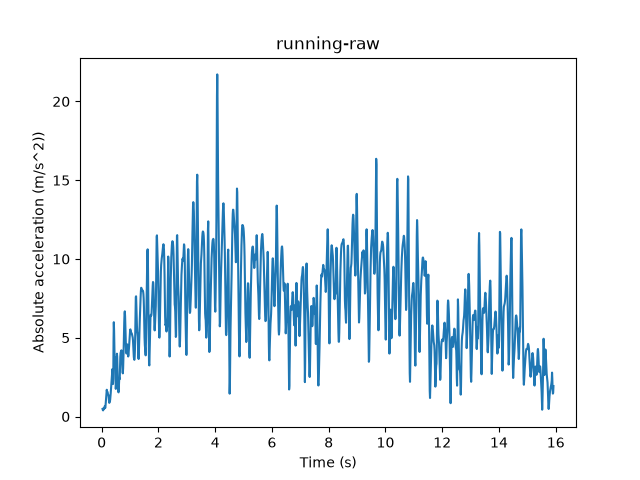
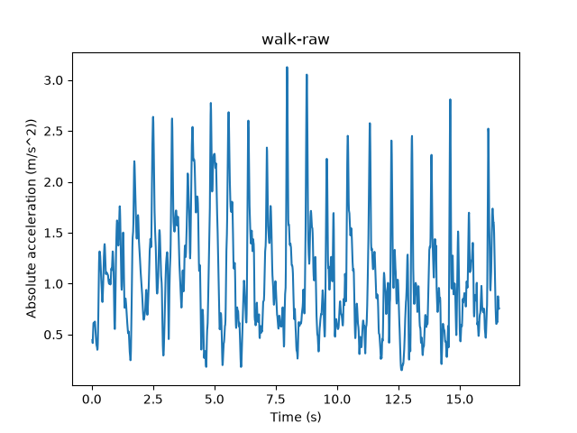
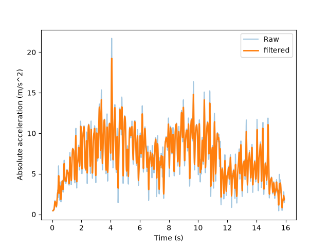
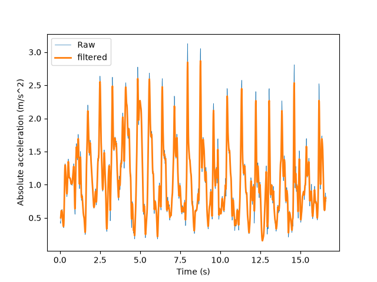

# P3:步行与跑步的加速度计算分析

## 数据来源
phyphox手机采集,步行/跑步各约16s,采样率约100Hz

## 分析流程
读数据->画原始曲线(发现毛刺严重)->手写滑动平均滤波->对比

## 滤波
每个点替换为窗口均值;窗口5 vs 51的选择(细节 vs 平滑)

## 结论
| 指标 | run | walk |
|---|---|---|
| 均值 | 7.11 | 1.07 |
| 标准差 | 2.92 | 0.54 |

跑步冲击强度约为走路的6.6倍;walk信号呈现清晰步态周期(约每秒2步)

## 运行
python analysis.py

## 原始信号

## 滤波后对比

